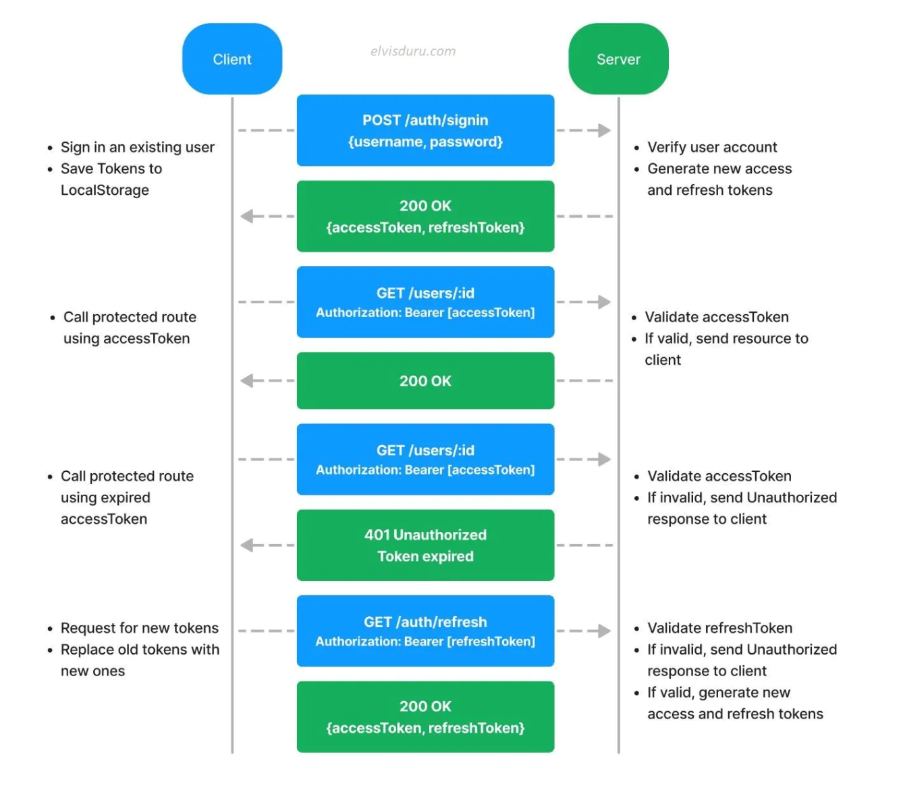

# brainfree-auth-api

## TechStack

* TypeScript
* NestJs
* TypeOrm
* PostgresDB

## OAuth2 flow



## Installation

```bash
$ yarn install
```

## Running the app

```bash
# development
$ yarn run start

# watch mode
$ yarn run start:dev

# production mode
$ yarn run start:prod
```

## Test

```bash
# unit tests
$ yarn run test

# e2e tests
$ yarn run test:e2e

# test coverage
$ yarn run test:cov
```

## Database

```bash 
$ cd /brainfree-auth/docker
$ docker-compose up -d
```

***

## API

### Auth

* [signup](localhost:3000/v1/auth/signup)
    - body

         ```json
          {
          "firstname": "jane",
          "lastname": "doe",
          "email": "test@mail.com",
          "password": "1234#4LsLs",
          "isActive": true,
          "roles": [
                {
                    "name": "User"
                }
          ]
         }
         ```

* [signing](localhost:3000/v1/auth/singing)
    - body

      ```json
      {
      "email": "test@mail.com",
      "password": "1234#4LsLs"
      }
      ```

* [sign-out](localhost:3000/v1/auth/sign-out)

---

### User

* [Get User by Mail](localhost:3000/v1/users/user)

